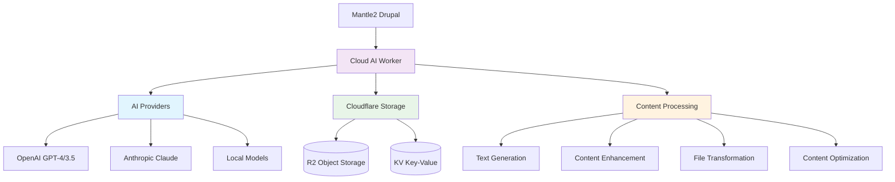

# Cloud - AI & Content Processing Worker

::: tip AI POWERHOUSE
**Cloud provides AI-powered content generation** and processing capabilities as part of The Earth App's Hybrid API architecture.
:::

## Overview

Cloud is a TypeScript Cloudflare Worker that handles AI operations, content generation, file processing, and serves as the intelligent layer of The Earth App ecosystem. It integrates seamlessly with Mantle2 to provide powerful hybrid capabilities.



## Key Features

### 🤖 AI Integration
- **Multiple AI providers** (OpenAI, Anthropic, local models)
- **Content generation** for articles, summaries, and creative writing
- **Content enhancement** and optimization
- **Prompt management** and template system
- **Response caching** for performance

### 📁 File Processing
- **File transformation** and format conversion
- **Content extraction** from documents
- **Image processing** and optimization
- **Batch processing** capabilities
- **R2 storage integration** for large files

### ⚡ Performance
- **Edge computing** with global distribution
- **KV caching** for frequently accessed data
- **Streaming responses** for large content generation
- **Request deduplication** to prevent duplicate AI calls
- **Rate limiting** and cost optimization

---

## Architecture

### Technology Stack
- **Platform:** Cloudflare Workers
- **Language:** TypeScript
- **Runtime:** V8 isolates
- **Storage:** Cloudflare KV + R2
- **AI Providers:** OpenAI API, Anthropic API
- **Build System:** Wrangler + esbuild
- **Testing:** Vitest + Miniflare

### Worker Structure
```
cloud/
├── src/
│   ├── index.ts              # Main worker entry point
│   ├── handlers/             # Route handlers
│   │   ├── ai.ts            # AI generation endpoints
│   │   ├── files.ts         # File processing endpoints
│   │   └── health.ts        # Health check endpoints
│   ├── services/            # Business logic services
│   │   ├── aiService.ts     # AI provider integrations
│   │   ├── cacheService.ts  # KV cache management
│   │   └── storageService.ts # R2 storage operations
│   ├── types/               # TypeScript type definitions
│   └── utils/               # Utility functions
├── wrangler.toml            # Cloudflare configuration
├── package.json             # Dependencies and scripts
└── tests/                   # Test suites
```

### Environment Configuration
```toml
# wrangler.toml
name = "earth-app-cloud"
main = "src/index.ts"
compatibility_date = "2023-10-01"

[env.production]
vars = { ENVIRONMENT = "production" }

[[env.production.kv_namespaces]]
binding = "CACHE"
id = "your-kv-namespace-id"

[[env.production.r2_buckets]]
binding = "STORAGE"
bucket_name = "earth-app-content"

[env.staging]
vars = { ENVIRONMENT = "staging" }
# Staging-specific configuration...
```

---

## API Reference

### AI Generation Endpoints

#### POST /ai/generate
**Description:** Generate content using AI

**Authentication:** Bearer token required

**Request:**
```bash
curl -X POST "{{CLOUD_API_URL}}/ai/generate" \
  -H "Authorization: Bearer <api-key>" \
  -H "Content-Type: application/json" \
  -d '{
    "prompt": "Write a blog post about sustainable technology",
    "type": "article",
    "options": {
      "max_tokens": 1000,
      "temperature": 0.7,
      "model": "gpt-4"
    }
  }'
```

**Response:**
```json
{
  "id": "gen_abc123",
  "content": "# Sustainable Technology: Building a Greener Future\n\nSustainable technology represents...",
  "metadata": {
    "model": "gpt-4",
    "tokens_used": 847,
    "generation_time": 2.3,
    "cost": 0.0169,
    "temperature": 0.7
  },
  "status": "completed",
  "created_at": "2025-09-29T12:34:56Z"
}
```

**Node.js (Fetch) Example:**
```javascript
const response = await fetch(`${CLOUD_API_URL}/ai/generate`, {
  method: 'POST',
  headers: {
    'Authorization': `Bearer ${apiKey}`,
    'Content-Type': 'application/json'
  },
  body: JSON.stringify({
    prompt: 'Write a blog post about sustainable technology',
    type: 'article',
    options: {
      max_tokens: 1000,
      temperature: 0.7,
      model: 'gpt-4'
    }
  })
});

const result = await response.json();
console.log(result.content);
```

**Node.js (Axios) Example:**
```javascript
const axios = require('axios');

const response = await axios.post(`${CLOUD_API_URL}/ai/generate`, {
  prompt: 'Write a blog post about sustainable technology',
  type: 'article',
  options: {
    max_tokens: 1000,
    temperature: 0.7,
    model: 'gpt-4'
  }
}, {
  headers: {
    'Authorization': `Bearer ${apiKey}`,
    'Content-Type': 'application/json'
  }
});

console.log(response.data.content);
```

**Python (Requests) Example:**
```python
import requests

response = requests.post(
    f"{CLOUD_API_URL}/ai/generate",
    headers={
        "Authorization": f"Bearer {api_key}",
        "Content-Type": "application/json"
    },
    json={
        "prompt": "Write a blog post about sustainable technology",
        "type": "article",
        "options": {
            "max_tokens": 1000,
            "temperature": 0.7,
            "model": "gpt-4"
        }
    }
)

result = response.json()
print(result["content"])
```

**Java (HttpClient) Example:**
```java
import java.net.http.*;
import java.net.URI;

HttpClient client = HttpClient.newHttpClient();

String requestBody = """
{
  "prompt": "Write a blog post about sustainable technology",
  "type": "article",
  "options": {
    "max_tokens": 1000,
    "temperature": 0.7,
    "model": "gpt-4"
  }
}
""";

HttpRequest request = HttpRequest.newBuilder()
    .uri(URI.create(CLOUD_API_URL + "/ai/generate"))
    .header("Authorization", "Bearer " + apiKey)
    .header("Content-Type", "application/json")
    .POST(HttpRequest.BodyPublishers.ofString(requestBody))
    .build();

HttpResponse<String> response = client.send(request, 
    HttpResponse.BodyHandlers.ofString());

System.out.println(response.body());
```

#### POST /ai/enhance
**Description:** Enhance existing content with AI

**Request:**
```bash
curl -X POST "{{CLOUD_API_URL}}/ai/enhance" \
  -H "Authorization: Bearer <api-key>" \
  -H "Content-Type: application/json" \
  -d '{
    "content": "Original content to be enhanced...",
    "type": "article",
    "enhancements": [
      "improve_readability",
      "add_examples",
      "strengthen_conclusion"
    ]
  }'
```

**Response:**
```json
{
  "id": "enhance_def456",
  "enhanced_content": "Enhanced version of the content...",
  "changes": [
    {
      "type": "improve_readability",
      "description": "Simplified complex sentences and improved flow",
      "section": "introduction"
    },
    {
      "type": "add_examples",
      "description": "Added relevant examples to support main points",
      "section": "body"
    }
  ],
  "metadata": {
    "original_word_count": 423,
    "enhanced_word_count": 567,
    "improvement_score": 8.5,
    "processing_time": 1.8
  }
}
```

#### GET /ai/models
**Description:** List available AI models

**Request:**
```bash
curl -X GET "{{CLOUD_API_URL}}/ai/models" \
  -H "Authorization: Bearer <api-key>"
```

**Response:**
```json
{
  "models": [
    {
      "id": "gpt-4",
      "provider": "openai",
      "name": "GPT-4",
      "description": "Most capable model for complex tasks",
      "max_tokens": 8192,
      "cost_per_1k_tokens": 0.03,
      "available": true
    },
    {
      "id": "gpt-3.5-turbo",
      "provider": "openai", 
      "name": "GPT-3.5 Turbo",
      "description": "Fast and efficient for most tasks",
      "max_tokens": 4096,
      "cost_per_1k_tokens": 0.002,
      "available": true
    },
    {
      "id": "claude-3-opus",
      "provider": "anthropic",
      "name": "Claude 3 Opus",
      "description": "Anthropic's most powerful model",
      "max_tokens": 4096,
      "cost_per_1k_tokens": 0.015,
      "available": true
    }
  ]
}
```

### File Processing Endpoints

#### POST /files/upload
**Description:** Upload and process files

**Request:**
```bash
curl -X POST "{{CLOUD_API_URL}}/files/upload" \
  -H "Authorization: Bearer <api-key>" \
  -F "file=@document.pdf" \
  -F "options={\"extract_text\":true,\"generate_summary\":true}"
```

**Response:**
```json
{
  "id": "file_ghi789",
  "filename": "document.pdf",
  "size": 1048576,
  "type": "application/pdf",
  "url": "https://storage.earth-app.example/files/document.pdf",
  "processing": {
    "text_extraction": {
      "status": "completed",
      "extracted_text": "Document content...",
      "word_count": 1247
    },
    "summary_generation": {
      "status": "completed",
      "summary": "This document discusses...",
      "key_points": ["Point 1", "Point 2"]
    }
  },
  "uploaded_at": "2025-09-29T12:34:56Z"
}
```

**Node.js (FormData) Example:**
```javascript
const formData = new FormData();
formData.append('file', fileBlob, 'document.pdf');
formData.append('options', JSON.stringify({
  extract_text: true,
  generate_summary: true
}));

const response = await fetch(`${CLOUD_API_URL}/files/upload`, {
  method: 'POST',
  headers: {
    'Authorization': `Bearer ${apiKey}`
  },
  body: formData
});

const result = await response.json();
```

#### GET /files/{id}
**Description:** Get file information and processed data

**Request:**
```bash
curl -X GET "{{CLOUD_API_URL}}/files/file_ghi789" \
  -H "Authorization: Bearer <api-key>"
```

**Response:**
```json
{
  "id": "file_ghi789",
  "filename": "document.pdf",
  "url": "https://storage.earth-app.example/files/document.pdf",
  "metadata": {
    "size": 1048576,
    "type": "application/pdf",
    "pages": 15,
    "created_at": "2025-09-29T12:34:56Z"
  },
  "processing_results": {
    "text_extraction": "Full extracted text...",
    "summary": "Document summary...",
    "entities": ["Entity 1", "Entity 2"],
    "topics": ["Topic A", "Topic B"]
  }
}
```

#### POST /files/{id}/transform
**Description:** Transform file to different format

**Request:**
```bash
curl -X POST "{{CLOUD_API_URL}}/files/file_ghi789/transform" \
  -H "Authorization: Bearer <api-key>" \
  -H "Content-Type: application/json" \
  -d '{
    "target_format": "markdown",
    "options": {
      "preserve_formatting": true,
      "include_images": false
    }
  }'
```

**Response:**
```json
{
  "id": "transform_jkl012",
  "original_file_id": "file_ghi789",
  "target_format": "markdown",
  "status": "completed",
  "transformed_content": "# Document Title\n\nContent in markdown format...",
  "download_url": "https://storage.earth-app.example/transformed/document.md",
  "processing_time": 3.2
}
```

### Cache Management

#### GET /cache/{key}
**Description:** Retrieve cached data

**Request:**
```bash
curl -X GET "{{CLOUD_API_URL}}/cache/generation_abc123" \
  -H "Authorization: Bearer <api-key>"
```

**Response:**
```json
{
  "key": "generation_abc123",
  "value": {
    "content": "Cached generated content...",
    "metadata": { "model": "gpt-4", "tokens": 500 }
  },
  "ttl": 3600,
  "created_at": "2025-09-29T12:00:00Z"
}
```

#### POST /cache/{key}
**Description:** Store data in cache

**Request:**
```bash
curl -X POST "{{CLOUD_API_URL}}/cache/my_key" \
  -H "Authorization: Bearer <api-key>" \
  -H "Content-Type: application/json" \
  -d '{
    "value": {"data": "to cache"},
    "ttl": 3600
  }'
```

**Response:**
```json
{
  "key": "my_key",
  "status": "stored",
  "ttl": 3600,
  "expires_at": "2025-09-29T13:34:56Z"
}
```

### Health & Monitoring

#### GET /health
**Description:** Health check endpoint

**Request:**
```bash
curl -X GET "{{CLOUD_API_URL}}/health"
```

**Response:**
```json
{
  "status": "healthy",
  "timestamp": "2025-09-29T12:34:56Z",
  "version": "1.2.3",
  "services": {
    "ai_providers": {
      "openai": "healthy",
      "anthropic": "healthy"
    },
    "storage": {
      "kv": "healthy",
      "r2": "healthy"
    }
  },
  "metrics": {
    "requests_per_minute": 127,
    "average_response_time": 234,
    "cache_hit_rate": 0.78
  }
}
```

---

## AI Provider Integration

### OpenAI Integration

```typescript
// Example: OpenAI service implementation
import OpenAI from 'openai';

export class OpenAIService {
  private client: OpenAI;
  
  constructor(apiKey: string) {
    this.client = new OpenAI({ apiKey });
  }
  
  async generateContent(prompt: string, options: GenerationOptions) {
    const response = await this.client.chat.completions.create({
      model: options.model || 'gpt-4',
      messages: [
        { role: 'user', content: prompt }
      ],
      max_tokens: options.max_tokens || 1000,
      temperature: options.temperature || 0.7
    });
    
    return {
      content: response.choices[0].message.content,
      usage: response.usage,
      model: response.model
    };
  }
  
  async streamGeneration(prompt: string, options: GenerationOptions) {
    const stream = await this.client.chat.completions.create({
      model: options.model || 'gpt-4',
      messages: [{ role: 'user', content: prompt }],
      stream: true,
      ...options
    });
    
    return stream;
  }
}
```

### Multi-Provider Strategy

```typescript
// Example: Provider abstraction
interface AIProvider {
  generateContent(prompt: string, options: GenerationOptions): Promise<GenerationResult>;
  streamGeneration(prompt: string, options: GenerationOptions): Promise<ReadableStream>;
  getAvailableModels(): Promise<Model[]>;
}

export class AIService {
  private providers: Map<string, AIProvider> = new Map();
  
  constructor() {
    this.providers.set('openai', new OpenAIService(env.OPENAI_API_KEY));
    this.providers.set('anthropic', new AnthropicService(env.ANTHROPIC_API_KEY));
  }
  
  async generateContent(request: GenerationRequest) {
    const provider = this.providers.get(request.provider || 'openai');
    if (!provider) {
      throw new Error(`Provider ${request.provider} not available`);
    }
    
    // Add caching layer
    const cacheKey = this.generateCacheKey(request);
    const cached = await this.cache.get(cacheKey);
    
    if (cached) {
      return cached;
    }
    
    const result = await provider.generateContent(request.prompt, request.options);
    
    // Cache the result
    await this.cache.put(cacheKey, result, { expirationTtl: 3600 });
    
    return result;
  }
}
```

## Storage & Caching

### R2 Storage Integration

```typescript
// Example: R2 storage service
export class StorageService {
  constructor(private r2: R2Bucket) {}
  
  async uploadFile(file: File, key: string): Promise<UploadResult> {
    // Generate unique key if not provided
    const fileKey = key || `${Date.now()}-${file.name}`;
    
    // Upload to R2
    await this.r2.put(fileKey, file.stream(), {
      httpMetadata: {
        contentType: file.type,
        contentLength: file.size
      }
    });
    
    return {
      key: fileKey,
      url: `https://storage.earth-app.example/${fileKey}`,
      size: file.size,
      type: file.type
    };
  }
  
  async getFile(key: string): Promise<R2ObjectBody | null> {
    return await this.r2.get(key);
  }
  
  async deleteFile(key: string): Promise<void> {
    await this.r2.delete(key);
  }
  
  async listFiles(prefix?: string): Promise<R2Objects> {
    return await this.r2.list({ prefix });
  }
}
```

### KV Caching Strategy

```typescript
// Example: KV cache service
export class CacheService {
  constructor(private kv: KVNamespace) {}
  
  async get<T>(key: string): Promise<T | null> {
    const value = await this.kv.get(key, 'json');
    return value as T;
  }
  
  async put<T>(key: string, value: T, options?: KVPutOptions): Promise<void> {
    await this.kv.put(key, JSON.stringify(value), options);
  }
  
  async delete(key: string): Promise<void> {
    await this.kv.delete(key);
  }
  
  // Generate cache key for AI requests
  generateCacheKey(prompt: string, options: GenerationOptions): string {
    const hash = this.hashString(prompt + JSON.stringify(options));
    return `ai_gen:${hash}`;
  }
  
  private hashString(str: string): string {
    // Simple hash function for demo
    let hash = 0;
    for (let i = 0; i < str.length; i++) {
      const char = str.charCodeAt(i);
      hash = ((hash << 5) - hash) + char;
      hash = hash & hash; // Convert to 32-bit integer
    }
    return Math.abs(hash).toString(36);
  }
}
```

---

## Development

### Local Development Setup

#### Prerequisites
- Node.js 18+
- Wrangler CLI
- Cloudflare account

#### Quick Start
```bash
# Clone repository
git clone https://github.com/earth-app/cloud.git
cd cloud

# Install dependencies
npm install

# Set up environment
cp .env.example .env
# Add your API keys to .env

# Start local development
npm run dev

# Test health endpoint
curl http://localhost:8787/health
```

#### Environment Configuration
```bash
# .env file
OPENAI_API_KEY=sk-your-openai-key
ANTHROPIC_API_KEY=your-anthropic-key
MANTLE2_API_KEY=your-mantle2-api-key
```

### Testing

#### Unit Tests
```bash
# Run unit tests
npm test

# Run tests with coverage
npm run test:coverage

# Watch mode for development
npm run test:watch
```

#### Integration Tests
```bash
# Test with Miniflare (local Cloudflare simulation)
npm run test:integration

# Test against staging environment
npm run test:e2e:staging
```

#### Example Test
```typescript
// tests/ai.test.ts
import { unstable_dev } from 'wrangler';

describe('AI Generation', () => {
  let worker: any;
  
  beforeAll(async () => {
    worker = await unstable_dev('src/index.ts', {
      experimental: { disableExperimentalWarning: true }
    });
  });
  
  afterAll(async () => {
    await worker.stop();
  });
  
  test('should generate content', async () => {
    const response = await worker.fetch('/ai/generate', {
      method: 'POST',
      headers: {
        'Authorization': 'Bearer test-key',
        'Content-Type': 'application/json'
      },
      body: JSON.stringify({
        prompt: 'Write a short story about a robot',
        options: { max_tokens: 100 }
      })
    });
    
    expect(response.status).toBe(200);
    
    const result = await response.json();
    expect(result.content).toBeDefined();
    expect(result.metadata.tokens_used).toBeLessThanOrEqual(100);
  });
});
```

### Performance Optimization

#### Caching Strategy
```typescript
// Implement intelligent caching
export class IntelligentCache {
  private static readonly DEFAULT_TTL = 3600; // 1 hour
  
  async cacheGenerationResult(
    prompt: string, 
    options: GenerationOptions, 
    result: GenerationResult
  ) {
    const key = this.generateCacheKey(prompt, options);
    
    // Adjust TTL based on content type and quality
    let ttl = IntelligentCache.DEFAULT_TTL;
    
    if (result.metadata.tokens_used > 1000) {
      ttl *= 2; // Cache longer responses longer
    }
    
    if (options.temperature < 0.3) {
      ttl *= 3; // Cache deterministic results longer
    }
    
    await this.cache.put(key, result, { expirationTtl: ttl });
  }
}
```

#### Request Deduplication
```typescript
// Prevent duplicate AI requests
export class RequestDeduplicator {
  private pendingRequests = new Map<string, Promise<any>>();
  
  async deduplicate<T>(key: string, fn: () => Promise<T>): Promise<T> {
    if (this.pendingRequests.has(key)) {
      return this.pendingRequests.get(key);
    }
    
    const promise = fn().finally(() => {
      this.pendingRequests.delete(key);
    });
    
    this.pendingRequests.set(key, promise);
    return promise;
  }
}
```

---

## Security

### API Key Management
```typescript
// Secure API key validation
export class SecurityService {
  private static readonly API_KEY_PREFIX = 'cloud_';
  
  validateApiKey(request: Request): boolean {
    const authHeader = request.headers.get('Authorization');
    if (!authHeader?.startsWith('Bearer ')) {
      return false;
    }
    
    const token = authHeader.slice(7);
    
    // Validate format
    if (!token.startsWith(SecurityService.API_KEY_PREFIX)) {
      return false;
    }
    
    // Validate against stored keys (implement based on your key storage)
    return this.isValidKey(token);
  }
  
  private isValidKey(token: string): boolean {
    // Implement key validation logic
    // Could check against KV store, environment variables, etc.
    return env.VALID_API_KEYS?.includes(token) ?? false;
  }
}
```

### Rate Limiting
```typescript
// Implement rate limiting
export class RateLimiter {
  private static readonly MAX_REQUESTS_PER_MINUTE = 60;
  
  async checkRateLimit(clientId: string): Promise<boolean> {
    const key = `rate_limit:${clientId}`;
    const current = await this.kv.get(key);
    
    if (!current) {
      await this.kv.put(key, '1', { expirationTtl: 60 });
      return true;
    }
    
    const count = parseInt(current);
    if (count >= RateLimiter.MAX_REQUESTS_PER_MINUTE) {
      return false;
    }
    
    await this.kv.put(key, (count + 1).toString(), { expirationTtl: 60 });
    return true;
  }
}
```

### Input Validation
```typescript
// Validate and sanitize inputs
export class InputValidator {
  static validateGenerationRequest(data: any): GenerationRequest {
    if (!data.prompt || typeof data.prompt !== 'string') {
      throw new Error('Invalid prompt');
    }
    
    if (data.prompt.length > 10000) {
      throw new Error('Prompt too long');
    }
    
    if (data.options?.max_tokens && data.options.max_tokens > 4000) {
      throw new Error('max_tokens too high');
    }
    
    return {
      prompt: data.prompt.trim(),
      type: data.type || 'general',
      options: {
        max_tokens: Math.min(data.options?.max_tokens || 1000, 4000),
        temperature: Math.max(0, Math.min(data.options?.temperature || 0.7, 2)),
        model: this.validateModel(data.options?.model)
      }
    };
  }
  
  private static validateModel(model?: string): string {
    const allowedModels = ['gpt-4', 'gpt-3.5-turbo', 'claude-3-opus'];
    return allowedModels.includes(model) ? model : 'gpt-3.5-turbo';
  }
}
```

---

## Deployment

### Production Deployment
```bash
# Build and deploy to production
npm run build
wrangler publish --env production

# Deploy with secrets
wrangler secret put OPENAI_API_KEY --env production
wrangler secret put ANTHROPIC_API_KEY --env production
```

### Environment Management
```bash
# Staging deployment
wrangler publish --env staging

# Preview deployment
wrangler publish --env preview

# Check deployment status
wrangler tail --env production
```

### Monitoring & Alerting
```typescript
// Example: Custom metrics and alerts
export class MonitoringService {
  async recordMetric(name: string, value: number, tags?: Record<string, string>) {
    // Send to your monitoring service (e.g., Datadog, New Relic)
    console.log(`METRIC: ${name} = ${value}`, tags);
  }
  
  async recordError(error: Error, context?: Record<string, any>) {
    // Send to error tracking service (e.g., Sentry)
    console.error('ERROR:', error.message, context);
  }
  
  async recordAIUsage(model: string, tokens: number, cost: number) {
    await this.recordMetric('ai.tokens_used', tokens, { model });
    await this.recordMetric('ai.cost', cost, { model });
  }
}
```

---

## Cost Optimization

### AI Cost Management
```typescript
// Monitor and optimize AI costs
export class CostOptimizer {
  private static readonly DAILY_BUDGET = 100; // $100/day
  private static readonly COST_PER_TOKEN = {
    'gpt-4': 0.00003,
    'gpt-3.5-turbo': 0.000002,
    'claude-3-opus': 0.000015
  };
  
  async checkBudget(model: string, estimatedTokens: number): Promise<boolean> {
    const estimatedCost = estimatedTokens * CostOptimizer.COST_PER_TOKEN[model];
    const todayKey = new Date().toISOString().split('T')[0];
    const spentToday = await this.kv.get(`budget:${todayKey}`) || 0;
    
    return (spentToday + estimatedCost) <= CostOptimizer.DAILY_BUDGET;
  }
  
  async recordSpend(model: string, actualTokens: number) {
    const cost = actualTokens * CostOptimizer.COST_PER_TOKEN[model];
    const todayKey = new Date().toISOString().split('T')[0];
    const spentToday = await this.kv.get(`budget:${todayKey}`) || 0;
    
    await this.kv.put(`budget:${todayKey}`, spentToday + cost, {
      expirationTtl: 86400 // 24 hours
    });
  }
}
```

---

## TODO: Implementation Details

This documentation requires analysis of the actual cloud repository:

### Required Investigation:
1. **Actual worker structure** and route implementations
2. **AI provider integrations** and model configurations
3. **Storage patterns** for R2 and KV usage
4. **Authentication and security** implementation
5. **Error handling** and monitoring setup

### Files to Analyze:
```bash
# Clone and examine the actual repository
git clone https://github.com/earth-app/cloud
cd cloud

# Examine worker structure
find src/ -name "*.ts" | head -20

# Check configuration
cat wrangler.toml

# Look for AI integrations
grep -r "openai\|anthropic\|ai" src/

# Check storage usage
grep -r "r2\|kv" src/
```

---

## Support & Resources

### Documentation
- **Cloudflare Workers:** https://developers.cloudflare.com/workers/
- **Wrangler CLI:** https://developers.cloudflare.com/workers/wrangler/
- **OpenAI API:** https://platform.openai.com/docs
- **Anthropic API:** https://docs.anthropic.com/

### Community
- **Repository:** https://github.com/earth-app/cloud
- **Issues:** Report bugs and feature requests
- **Discussions:** AI integration and performance questions
- **Maintainer:** [@gmitch215](https://github.com/gmitch215)

### Getting Help
- **Development Questions:** File issues in the repository
- **AI Integration:** Check AI provider documentation
- **Performance Issues:** See monitoring and optimization guides
- **Hybrid API Questions:** See [Hybrid API documentation](/docs/hybrid-api)