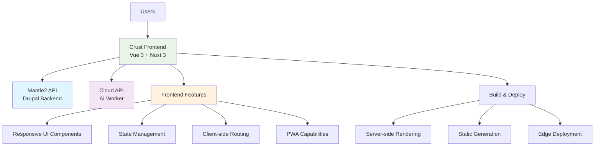

# Crust - Frontend Application

::: tip FRONTEND POWERHOUSE
**Crust provides the user interface** for The Earth App, built with Vue/Nuxt and TypeScript, integrating seamlessly with the Hybrid API (Mantle2 + Cloud).
:::

## Overview

Crust is the frontend application that serves as the user-facing interface for The Earth App ecosystem. Built with modern web technologies, it provides a responsive, performant, and intuitive experience while leveraging the powerful backend capabilities of Mantle2 and Cloud.



## Key Features

### 🎨 Modern UI/UX
- **Responsive design** for desktop, tablet, and mobile
- **Component-based architecture** with reusable Vue components
- **TypeScript support** for type safety and better DX
- **Accessibility (a11y)** compliance and best practices
- **Dark/light theme** support

### ⚡ Performance
- **Server-side rendering (SSR)** for faster initial loads
- **Static site generation (SSG)** for optimal performance
- **Code splitting** and lazy loading
- **Image optimization** and modern formats
- **Progressive Web App (PWA)** capabilities

### 🔗 API Integration
- **Seamless integration** with Mantle2 for data operations
- **Real-time AI generation** via Cloud integration
- **Optimistic updates** for better user experience
- **Error handling** and offline support
- **Caching strategies** for performance

---

## Architecture

### Technology Stack
- **Framework:** Nuxt 3
- **Frontend Library:** Vue 3 (Composition API)
- **Language:** TypeScript
- **Styling:** Tailwind CSS / Vuetify / Custom CSS
- **State Management:** Pinia
- **Build Tool:** Vite
- **Testing:** Vitest + Vue Test Utils
- **Deployment:** Cloudflare Pages / Vercel / Netlify

### Project Structure
```
crust/
├── components/              # Vue components
│   ├── UI/                 # Base UI components
│   ├── Content/            # Content-specific components
│   ├── Forms/              # Form components
│   └── Layout/             # Layout components
├── composables/            # Vue composables
├── layouts/                # Nuxt layouts
├── pages/                  # File-based routing
├── plugins/                # Nuxt plugins
├── middleware/             # Route middleware
├── stores/                 # Pinia stores
├── types/                  # TypeScript types
├── utils/                  # Utility functions
├── assets/                 # Static assets
├── public/                 # Public files
├── server/                 # Server-side code
└── tests/                  # Test files
```

### API Integration Layer
```typescript
// utils/api.ts - API client abstraction
export class ApiClient {
  private mantle2BaseUrl: string;
  private cloudBaseUrl: string;
  
  constructor() {
    this.mantle2BaseUrl = useRuntimeConfig().public.mantle2ApiUrl;
    this.cloudBaseUrl = useRuntimeConfig().public.cloudApiUrl;
  }
  
  // Mantle2 API calls
  async fetchContent(type: string, params?: Record<string, any>) {
    return await $fetch(`/jsonapi/node/${type}`, {
      baseURL: this.mantle2BaseUrl,
      headers: this.getAuthHeaders(),
      params
    });
  }
  
  async createContent(type: string, data: any) {
    return await $fetch(`/jsonapi/node/${type}`, {
      method: 'POST',
      baseURL: this.mantle2BaseUrl,
      headers: {
        ...this.getAuthHeaders(),
        'Content-Type': 'application/vnd.api+json'
      },
      body: { data }
    });
  }
  
  // Cloud API calls
  async generateContent(prompt: string, options: any = {}) {
    return await $fetch('/ai/generate', {
      method: 'POST',
      baseURL: this.cloudBaseUrl,
      headers: this.getAuthHeaders(),
      body: { prompt, options }
    });
  }
  
  private getAuthHeaders() {
    const authStore = useAuthStore();
    return authStore.token ? {
      'Authorization': `Bearer ${authStore.token}`
    } : {};
  }
}
```

---

## User Interface Components

### Core Components

#### Content Display Components

**ArticleCard.vue**
```vue
<template>
  <div class="article-card">
    <div class="article-header">
      <h3 class="article-title">{{ article.title }}</h3>
      <span class="article-date">{{ formatDate(article.created) }}</span>
    </div>
    
    <div class="article-content" v-html="article.summary"></div>
    
    <div class="article-footer">
      <div class="article-tags">
        <span 
          v-for="tag in article.tags" 
          :key="tag" 
          class="tag"
        >
          {{ tag }}
        </span>
      </div>
      
      <div class="article-actions">
        <UiButton 
          variant="outline" 
          @click="$emit('edit', article.id)"
        >
          Edit
        </UiButton>
        
        <UiButton 
          variant="primary" 
          @click="$emit('view', article.id)"
        >
          View
        </UiButton>
      </div>
    </div>
  </div>
</template>

<script setup lang="ts">
interface Article {
  id: string;
  title: string;
  summary: string;
  created: string;
  tags: string[];
}

defineProps<{
  article: Article;
}>();

defineEmits<{
  edit: [id: string];
  view: [id: string];
}>();

const formatDate = (dateString: string) => {
  return new Date(dateString).toLocaleDateString();
};
</script>
```

**AIGenerationWidget.vue**
```vue
<template>
  <div class="ai-generation-widget">
    <form @submit.prevent="generateContent" class="generation-form">
      <div class="form-group">
        <label for="prompt">Content Prompt</label>
        <textarea
          id="prompt"
          v-model="prompt"
          placeholder="Describe what you want to generate..."
          rows="4"
          required
        ></textarea>
      </div>
      
      <div class="form-row">
        <div class="form-group">
          <label for="type">Content Type</label>
          <select id="type" v-model="contentType">
            <option value="article">Article</option>
            <option value="summary">Summary</option>
            <option value="creative">Creative Writing</option>
          </select>
        </div>
        
        <div class="form-group">
          <label for="length">Length</label>
          <select id="length" v-model="options.max_tokens">
            <option :value="500">Short (500 words)</option>
            <option :value="1000">Medium (1000 words)</option>
            <option :value="2000">Long (2000 words)</option>
          </select>
        </div>
      </div>
      
      <UiButton 
        type="submit" 
        :loading="isGenerating"
        :disabled="!prompt.trim()"
      >
        {{ isGenerating ? 'Generating...' : 'Generate Content' }}
      </UiButton>
    </form>
    
    <div v-if="generatedContent" class="generated-content">
      <h4>Generated Content</h4>
      <div class="content-preview" v-html="generatedContent"></div>
      
      <div class="content-actions">
        <UiButton variant="outline" @click="copyToClipboard">
          Copy
        </UiButton>
        <UiButton variant="primary" @click="saveContent">
          Save as Draft
        </UiButton>
      </div>
    </div>
  </div>
</template>

<script setup lang="ts">
const prompt = ref('');
const contentType = ref('article');
const options = ref({
  max_tokens: 1000,
  temperature: 0.7
});

const isGenerating = ref(false);
const generatedContent = ref('');

const apiClient = new ApiClient();

const generateContent = async () => {
  if (!prompt.value.trim()) return;
  
  isGenerating.value = true;
  
  try {
    const result = await apiClient.generateContent(prompt.value, {
      type: contentType.value,
      ...options.value
    });
    
    generatedContent.value = result.content;
    
    // Track analytics
    useTrackEvent('ai_generation_success', {
      type: contentType.value,
      tokens: result.metadata.tokens_used
    });
    
  } catch (error) {
    useNotification().error('Failed to generate content. Please try again.');
    console.error('Generation error:', error);
  } finally {
    isGenerating.value = false;
  }
};

const copyToClipboard = async () => {
  try {
    await navigator.clipboard.writeText(generatedContent.value);
    useNotification().success('Content copied to clipboard');
  } catch (error) {
    console.error('Copy failed:', error);
  }
};

const saveContent = async () => {
  try {
    await apiClient.createContent('article', {
      type: 'node--article',
      attributes: {
        title: `Generated: ${contentType.value}`,
        body: {
          value: generatedContent.value,
          format: 'basic_html'
        },
        status: false // Save as draft
      }
    });
    
    useNotification().success('Content saved as draft');
    
    // Reset form
    prompt.value = '';
    generatedContent.value = '';
    
  } catch (error) {
    useNotification().error('Failed to save content');
    console.error('Save error:', error);
  }
};
</script>
```

### State Management

#### Content Store (Pinia)
```typescript
// stores/content.ts
export const useContentStore = defineStore('content', () => {
  // State
  const articles = ref<Article[]>([]);
  const currentArticle = ref<Article | null>(null);
  const isLoading = ref(false);
  const error = ref<string | null>(null);
  
  // API client
  const apiClient = new ApiClient();
  
  // Actions
  const fetchArticles = async (params?: Record<string, any>) => {
    isLoading.value = true;
    error.value = null;
    
    try {
      const response = await apiClient.fetchContent('article', params);
      articles.value = response.data.map(transformArticle);
    } catch (err) {
      error.value = 'Failed to fetch articles';
      console.error('Fetch error:', err);
    } finally {
      isLoading.value = false;
    }
  };
  
  const createArticle = async (articleData: CreateArticleData) => {
    try {
      const response = await apiClient.createContent('article', {
        type: 'node--article',
        attributes: {
          title: articleData.title,
          body: {
            value: articleData.content,
            format: 'basic_html'
          },
          status: articleData.published
        }
      });
      
      const newArticle = transformArticle(response.data);
      articles.value.unshift(newArticle);
      
      return newArticle;
    } catch (err) {
      error.value = 'Failed to create article';
      throw err;
    }
  };
  
  const updateArticle = async (id: string, updates: Partial<Article>) => {
    try {
      const response = await apiClient.updateContent('article', id, updates);
      const updatedArticle = transformArticle(response.data);
      
      const index = articles.value.findIndex(a => a.id === id);
      if (index !== -1) {
        articles.value[index] = updatedArticle;
      }
      
      return updatedArticle;
    } catch (err) {
      error.value = 'Failed to update article';
      throw err;
    }
  };
  
  const deleteArticle = async (id: string) => {
    try {
      await apiClient.deleteContent('article', id);
      articles.value = articles.value.filter(a => a.id !== id);
    } catch (err) {
      error.value = 'Failed to delete article';
      throw err;
    }
  };
  
  // Getters
  const publishedArticles = computed(() => 
    articles.value.filter(article => article.published)
  );
  
  const draftArticles = computed(() => 
    articles.value.filter(article => !article.published)
  );
  
  return {
    // State
    articles: readonly(articles),
    currentArticle: readonly(currentArticle),
    isLoading: readonly(isLoading),
    error: readonly(error),
    
    // Actions
    fetchArticles,
    createArticle,
    updateArticle,
    deleteArticle,
    
    // Getters
    publishedArticles,
    draftArticles
  };
});

// Helper function to transform API response
function transformArticle(apiArticle: any): Article {
  return {
    id: apiArticle.id,
    title: apiArticle.attributes.title,
    content: apiArticle.attributes.body?.value || '',
    summary: apiArticle.attributes.body?.summary || '',
    published: apiArticle.attributes.status,
    created: apiArticle.attributes.created,
    updated: apiArticle.attributes.changed,
    author: apiArticle.relationships?.uid?.data?.id,
    tags: apiArticle.attributes.field_tags || []
  };
}
```

#### Auth Store
```typescript
// stores/auth.ts
export const useAuthStore = defineStore('auth', () => {
  // State
  const user = ref<User | null>(null);
  const token = ref<string | null>(null);
  const isAuthenticated = computed(() => !!user.value && !!token.value);
  
  // Persistence
  const tokenCookie = useCookie('auth-token', {
    default: () => null,
    maxAge: 60 * 60 * 24 * 7, // 7 days
    secure: true,
    sameSite: 'strict'
  });
  
  // Initialize from cookie
  if (tokenCookie.value) {
    token.value = tokenCookie.value;
  }
  
  // Actions
  const login = async (credentials: LoginCredentials) => {
    try {
      const response = await $fetch('/user/login?_format=json', {
        method: 'POST',
        baseURL: useRuntimeConfig().public.mantle2ApiUrl,
        body: {
          name: credentials.username,
          pass: credentials.password
        }
      });
      
      // Store authentication data
      user.value = response.current_user;
      token.value = response.csrf_token;
      tokenCookie.value = response.csrf_token;
      
      // Redirect to intended page or dashboard
      await navigateTo(credentials.redirectTo || '/dashboard');
      
    } catch (error) {
      throw new Error('Invalid credentials');
    }
  };
  
  const logout = async () => {
    try {
      if (token.value) {
        await $fetch('/user/logout', {
          method: 'POST',
          baseURL: useRuntimeConfig().public.mantle2ApiUrl,
          headers: {
            'Authorization': `Bearer ${token.value}`
          }
        });
      }
    } finally {
      // Clear local state regardless of API success
      user.value = null;
      token.value = null;
      tokenCookie.value = null;
      
      await navigateTo('/login');
    }
  };
  
  const fetchCurrentUser = async () => {
    if (!token.value) return;
    
    try {
      const response = await $fetch('/jsonapi/user/user', {
        baseURL: useRuntimeConfig().public.mantle2ApiUrl,
        headers: {
          'Authorization': `Bearer ${token.value}`
        }
      });
      
      if (response.data?.[0]) {
        user.value = transformUser(response.data[0]);
      }
    } catch (error) {
      // Token might be invalid, clear auth state
      await logout();
    }
  };
  
  // Initialize user on store creation
  if (token.value) {
    fetchCurrentUser();
  }
  
  return {
    user: readonly(user),
    token: readonly(token),
    isAuthenticated,
    login,
    logout,
    fetchCurrentUser
  };
});
```

---

## Pages & Routing

### Key Pages

#### Home Page (`pages/index.vue`)
```vue
<template>
  <div class="home-page">
    <HeroSection />
    
    <section class="featured-content">
      <div class="container">
        <h2>Latest Articles</h2>
        <div class="articles-grid">
          <ArticleCard 
            v-for="article in featuredArticles" 
            :key="article.id"
            :article="article"
            @view="viewArticle"
          />
        </div>
        
        <div class="text-center">
          <UiButton @click="$router.push('/articles')">
            View All Articles
          </UiButton>
        </div>
      </div>
    </section>
    
    <AIShowcaseSection />
  </div>
</template>

<script setup lang="ts">
// SEO
useHead({
  title: 'The Earth App - Sustainable Technology Content',
  meta: [
    { name: 'description', content: 'Discover sustainable technology insights powered by AI' }
  ]
});

// Data fetching
const contentStore = useContentStore();
const { data: featuredArticles } = await useLazyAsyncData(
  'featured-articles',
  () => contentStore.fetchArticles({ 
    featured: true, 
    limit: 6 
  })
);

const viewArticle = (id: string) => {
  navigateTo(`/articles/${id}`);
};
</script>
```

#### Article Management (`pages/dashboard/articles/index.vue`)
```vue
<template>
  <div class="articles-dashboard">
    <DashboardHeader>
      <template #title>Articles</template>
      <template #actions>
        <UiButton @click="$router.push('/dashboard/articles/create')">
          Create Article
        </UiButton>
      </template>
    </DashboardHeader>
    
    <div class="articles-filters">
      <SearchInput v-model="searchQuery" placeholder="Search articles..." />
      
      <FilterSelect 
        v-model="statusFilter"
        :options="[
          { value: 'all', label: 'All Status' },
          { value: 'published', label: 'Published' },
          { value: 'draft', label: 'Draft' }
        ]"
      />
    </div>
    
    <ArticlesTable 
      :articles="filteredArticles"
      :loading="contentStore.isLoading"
      @edit="editArticle"
      @delete="deleteArticle"
      @publish="publishArticle"
    />
    
    <Pagination 
      v-model="currentPage"
      :total="totalArticles"
      :per-page="20"
    />
  </div>
</template>

<script setup lang="ts">
// Auth guard
definePageMeta({
  middleware: 'auth'
});

// Data
const contentStore = useContentStore();
const searchQuery = ref('');
const statusFilter = ref('all');
const currentPage = ref(1);

// Computed
const filteredArticles = computed(() => {
  let articles = contentStore.articles;
  
  if (searchQuery.value) {
    articles = articles.filter(article => 
      article.title.toLowerCase().includes(searchQuery.value.toLowerCase())
    );
  }
  
  if (statusFilter.value !== 'all') {
    articles = articles.filter(article => 
      statusFilter.value === 'published' ? article.published : !article.published
    );
  }
  
  return articles;
});

const totalArticles = computed(() => filteredArticles.value.length);

// Actions
const editArticle = (id: string) => {
  navigateTo(`/dashboard/articles/${id}/edit`);
};

const deleteArticle = async (id: string) => {
  if (confirm('Are you sure you want to delete this article?')) {
    try {
      await contentStore.deleteArticle(id);
      useNotification().success('Article deleted successfully');
    } catch (error) {
      useNotification().error('Failed to delete article');
    }
  }
};

const publishArticle = async (id: string) => {
  try {
    await contentStore.updateArticle(id, { published: true });
    useNotification().success('Article published successfully');
  } catch (error) {
    useNotification().error('Failed to publish article');
  }
};

// Initialize data
await contentStore.fetchArticles();
</script>
```

#### AI Content Generation (`pages/dashboard/generate.vue`)
```vue
<template>
  <div class="ai-generation-page">
    <DashboardHeader>
      <template #title>AI Content Generation</template>
    </DashboardHeader>
    
    <div class="generation-workspace">
      <div class="generation-panel">
        <AIGenerationWidget @generated="handleGenerated" />
      </div>
      
      <div class="preview-panel" v-if="generatedContent">
        <h3>Preview</h3>
        <ContentPreview :content="generatedContent" />
        
        <div class="preview-actions">
          <UiButton variant="outline" @click="regenerateContent">
            Regenerate
          </UiButton>
          <UiButton @click="saveAsArticle">
            Save as Article
          </UiButton>
        </div>
      </div>
    </div>
    
    <RecentGenerations />
  </div>
</template>

<script setup lang="ts">
definePageMeta({
  middleware: 'auth'
});

const generatedContent = ref<GeneratedContent | null>(null);

const handleGenerated = (content: GeneratedContent) => {
  generatedContent.value = content;
  
  // Track usage analytics
  useTrackEvent('ai_content_generated', {
    type: content.type,
    word_count: content.word_count
  });
};

const regenerateContent = () => {
  // Re-trigger generation with same parameters
  generatedContent.value = null;
};

const saveAsArticle = async () => {
  if (!generatedContent.value) return;
  
  const contentStore = useContentStore();
  
  try {
    const article = await contentStore.createArticle({
      title: generatedContent.value.title || 'Generated Article',
      content: generatedContent.value.content,
      published: false
    });
    
    useNotification().success('Article saved as draft');
    await navigateTo(`/dashboard/articles/${article.id}/edit`);
    
  } catch (error) {
    useNotification().error('Failed to save article');
  }
};
</script>
```

### Middleware

#### Auth Middleware (`middleware/auth.ts`)
```typescript
export default defineNuxtRouteMiddleware((to) => {
  const authStore = useAuthStore();
  
  if (!authStore.isAuthenticated) {
    return navigateTo({
      path: '/login',
      query: { redirectTo: to.fullPath }
    });
  }
});
```

#### Admin Middleware (`middleware/admin.ts`)
```typescript
export default defineNuxtRouteMiddleware(() => {
  const authStore = useAuthStore();
  
  if (!authStore.user?.roles.includes('administrator')) {
    throw createError({
      statusCode: 403,
      statusMessage: 'Access Denied'
    });
  }
});
```

---

## Composables

### API Integration Composable
```typescript
// composables/useApi.ts
export const useApi = () => {
  const apiClient = new ApiClient();
  
  // Content operations
  const useContent = () => ({
    fetch: (type: string, params?: any) => apiClient.fetchContent(type, params),
    create: (type: string, data: any) => apiClient.createContent(type, data),
    update: (type: string, id: string, data: any) => apiClient.updateContent(type, id, data),
    delete: (type: string, id: string) => apiClient.deleteContent(type, id)
  });
  
  // AI operations
  const useAI = () => ({
    generate: (prompt: string, options?: any) => apiClient.generateContent(prompt, options),
    enhance: (content: string, options?: any) => apiClient.enhanceContent(content, options),
    models: () => apiClient.getAvailableModels()
  });
  
  // File operations
  const useFiles = () => ({
    upload: (file: File, options?: any) => apiClient.uploadFile(file, options),
    process: (fileId: string, options?: any) => apiClient.processFile(fileId, options),
    download: (fileId: string) => apiClient.downloadFile(fileId)
  });
  
  return {
    content: useContent(),
    ai: useAI(),
    files: useFiles()
  };
};
```

### Notification Composable
```typescript
// composables/useNotification.ts
interface Notification {
  id: string;
  type: 'success' | 'error' | 'warning' | 'info';
  title: string;
  message?: string;
  duration?: number;
}

export const useNotification = () => {
  const notifications = useState<Notification[]>('notifications', () => []);
  
  const add = (notification: Omit<Notification, 'id'>) => {
    const id = Date.now().toString();
    const newNotification = { 
      id, 
      duration: 5000, 
      ...notification 
    };
    
    notifications.value.push(newNotification);
    
    // Auto-remove after duration
    setTimeout(() => {
      remove(id);
    }, newNotification.duration);
    
    return id;
  };
  
  const remove = (id: string) => {
    const index = notifications.value.findIndex(n => n.id === id);
    if (index > -1) {
      notifications.value.splice(index, 1);
    }
  };
  
  const clear = () => {
    notifications.value = [];
  };
  
  // Convenience methods
  const success = (title: string, message?: string) => 
    add({ type: 'success', title, message });
    
  const error = (title: string, message?: string) => 
    add({ type: 'error', title, message });
    
  const warning = (title: string, message?: string) => 
    add({ type: 'warning', title, message });
    
  const info = (title: string, message?: string) => 
    add({ type: 'info', title, message });
  
  return {
    notifications: readonly(notifications),
    add,
    remove,
    clear,
    success,
    error,
    warning,
    info
  };
};
```

### Analytics Composable
```typescript
// composables/useAnalytics.ts
export const useAnalytics = () => {
  const trackEvent = (event: string, properties?: Record<string, any>) => {
    // Send to analytics service (Google Analytics, Mixpanel, etc.)
    if (process.client && window.gtag) {
      window.gtag('event', event, properties);
    }
    
    // Also log for debugging in development
    if (process.dev) {
      console.log('Analytics Event:', event, properties);
    }
  };
  
  const trackPageView = (path: string) => {
    if (process.client && window.gtag) {
      window.gtag('config', 'GA_TRACKING_ID', {
        page_path: path
      });
    }
  };
  
  const trackUserAction = (action: string, context?: Record<string, any>) => {
    trackEvent('user_action', {
      action,
      timestamp: new Date().toISOString(),
      ...context
    });
  };
  
  return {
    trackEvent,
    trackPageView,
    trackUserAction
  };
};

// Auto-track route changes
export const useTrackEvent = (event: string, properties?: Record<string, any>) => {
  const analytics = useAnalytics();
  analytics.trackEvent(event, properties);
};
```

---

## Development

### Local Development Setup

#### Prerequisites
- Node.js 18+
- npm/pnpm/yarn
- Git

#### Quick Start
```bash
# Clone repository
git clone https://github.com/earth-app/crust.git
cd crust

# Install dependencies
npm install
# or
pnpm install

# Set up environment
cp .env.example .env
# Configure API endpoints and keys

# Start development server
npm run dev

# Open browser to http://localhost:3000
```

#### Environment Configuration
```bash
# .env file
NUXT_PUBLIC_MANTLE2_API_URL=http://localhost:8080
NUXT_PUBLIC_CLOUD_API_URL=http://localhost:8787
NUXT_PUBLIC_GA_TRACKING_ID=G-XXXXXXXXXX

# Optional: for local development
NUXT_DEV_MODE=true
NUXT_PUBLIC_DEBUG=true
```

### Development Workflow

#### Component Development
```bash
# Generate new component
npm run generate:component ComponentName

# Run Storybook for component development
npm run storybook

# Test components in isolation
npm run test:component
```

#### API Integration Testing
```bash
# Test against local APIs
npm run dev:local

# Test against staging APIs
npm run dev:staging

# Run API integration tests
npm run test:api
```

### Testing

#### Unit Tests
```bash
# Run unit tests
npm run test

# Run tests in watch mode
npm run test:watch

# Generate coverage report
npm run test:coverage
```

#### Component Tests
```vue
<!-- tests/components/ArticleCard.test.ts -->
<script setup lang="ts">
import { mount } from '@vue/test-utils';
import { describe, it, expect } from 'vitest';
import ArticleCard from '~/components/ArticleCard.vue';

describe('ArticleCard', () => {
  const mockArticle = {
    id: '1',
    title: 'Test Article',
    summary: 'Test summary',
    created: '2025-09-29T12:00:00Z',
    tags: ['test', 'vue']
  };
  
  it('renders article information correctly', () => {
    const wrapper = mount(ArticleCard, {
      props: { article: mockArticle }
    });
    
    expect(wrapper.find('.article-title').text()).toBe('Test Article');
    expect(wrapper.find('.article-content').html()).toContain('Test summary');
    expect(wrapper.findAll('.tag')).toHaveLength(2);
  });
  
  it('emits edit event when edit button is clicked', async () => {
    const wrapper = mount(ArticleCard, {
      props: { article: mockArticle }
    });
    
    await wrapper.find('[data-test="edit-button"]').trigger('click');
    
    expect(wrapper.emitted('edit')).toBeTruthy();
    expect(wrapper.emitted('edit')?.[0]).toEqual(['1']);
  });
});
</script>
```

#### E2E Tests
```typescript
// tests/e2e/article-creation.spec.ts
import { test, expect } from '@playwright/test';

test('user can create an article', async ({ page }) => {
  // Login
  await page.goto('/login');
  await page.fill('[data-test="username"]', 'testuser');
  await page.fill('[data-test="password"]', 'password');
  await page.click('[data-test="login-button"]');
  
  // Navigate to article creation
  await page.goto('/dashboard/articles/create');
  
  // Fill article form
  await page.fill('[data-test="article-title"]', 'Test Article');
  await page.fill('[data-test="article-content"]', 'This is test content');
  
  // Save as draft
  await page.click('[data-test="save-draft"]');
  
  // Verify success
  await expect(page.locator('[data-test="notification"]')).toContainText('Article saved');
  
  // Verify article appears in list
  await page.goto('/dashboard/articles');
  await expect(page.locator('[data-test="article-list"]')).toContainText('Test Article');
});
```

### Build & Deployment

#### Production Build
```bash
# Build for production
npm run build

# Preview production build
npm run preview

# Generate static site (if using SSG)
npm run generate
```

#### Deployment Configurations

**Cloudflare Pages**
```typescript
// nuxt.config.ts
export default defineNuxtConfig({
  nitro: {
    preset: 'cloudflare-pages'
  },
  
  // Cloudflare Pages environment variables
  runtimeConfig: {
    public: {
      mantle2ApiUrl: process.env.NUXT_PUBLIC_MANTLE2_API_URL,
      cloudApiUrl: process.env.NUXT_PUBLIC_CLOUD_API_URL
    }
  }
});
```

**Vercel**
```json
// vercel.json
{
  "buildCommand": "npm run build",
  "outputDirectory": ".output/public",
  "framework": "nuxtjs",
  "env": {
    "NUXT_PUBLIC_MANTLE2_API_URL": "@mantle2-api-url",
    "NUXT_PUBLIC_CLOUD_API_URL": "@cloud-api-url"
  }
}
```

---

## Performance Optimization

### Code Splitting & Lazy Loading
```vue
<!-- Lazy load heavy components -->
<template>
  <div>
    <Suspense>
      <LazyAIGenerationWidget v-if="showAIWidget" />
      <template #fallback>
        <div class="loading-placeholder">Loading AI Widget...</div>
      </template>
    </Suspense>
  </div>
</template>

<script setup lang="ts">
// Lazy load components
const LazyAIGenerationWidget = defineAsyncComponent(
  () => import('~/components/AIGenerationWidget.vue')
);

const showAIWidget = ref(false);

// Load widget when needed
onMounted(() => {
  // Load after initial render
  nextTick(() => {
    showAIWidget.value = true;
  });
});
</script>
```

### Image Optimization
```vue
<template>
  <NuxtImg
    :src="article.image"
    :alt="article.title"
    width="400"
    height="300"
    format="webp"
    quality="80"
    loading="lazy"
    class="article-image"
  />
</template>
```

### Caching Strategies
```typescript
// nuxt.config.ts
export default defineNuxtConfig({
  // Enable caching for API responses
  nitro: {
    storage: {
      redis: {
        driver: 'redis',
        /* redis connector options */
      }
    }
  },
  
  // Route-level caching
  routeRules: {
    '/': { prerender: true },
    '/articles/**': { isr: 3600 }, // Regenerate every hour
    '/dashboard/**': { index: false } // Don't index admin pages
  }
});
```

---

## Security

### Content Security Policy
```typescript
// nuxt.config.ts
export default defineNuxtConfig({
  security: {
    headers: {
      contentSecurityPolicy: {
        'default-src': ["'self'"],
        'script-src': ["'self'", "'unsafe-inline'", 'https://www.googletagmanager.com'],
        'style-src': ["'self'", "'unsafe-inline'"],
        'img-src': ["'self'", 'data:', 'https:'],
        'font-src': ["'self'"],
        'connect-src': ["'self'", process.env.NUXT_PUBLIC_MANTLE2_API_URL, process.env.NUXT_PUBLIC_CLOUD_API_URL]
      }
    }
  }
});
```

### Input Validation & Sanitization
```typescript
// utils/validation.ts
import DOMPurify from 'dompurify';

export const sanitizeHtml = (html: string): string => {
  if (process.client) {
    return DOMPurify.sanitize(html);
  }
  // Server-side fallback
  return html.replace(/<script\b[^<]*(?:(?!<\/script>)<[^<]*)*<\/script>/gi, '');
};

export const validateForm = (data: any, schema: any) => {
  // Implement validation logic
  const errors: Record<string, string> = {};
  
  for (const [field, rules] of Object.entries(schema)) {
    const value = data[field];
    
    if (rules.required && (!value || value.trim() === '')) {
      errors[field] = `${field} is required`;
    }
    
    if (rules.minLength && value && value.length < rules.minLength) {
      errors[field] = `${field} must be at least ${rules.minLength} characters`;
    }
    
    if (rules.maxLength && value && value.length > rules.maxLength) {
      errors[field] = `${field} must not exceed ${rules.maxLength} characters`;
    }
    
    if (rules.pattern && value && !rules.pattern.test(value)) {
      errors[field] = `${field} format is invalid`;
    }
  }
  
  return {
    isValid: Object.keys(errors).length === 0,
    errors
  };
};
```

---

## API Integration Examples

### Hybrid API Usage Examples

#### Content Creation with AI Enhancement
```typescript
// Example: Create article with AI assistance
const createEnhancedArticle = async (baseContent: string) => {
  const api = useApi();
  
  try {
    // Step 1: Enhance content with AI
    const enhanced = await api.ai.enhance(baseContent, {
      improvements: ['readability', 'engagement', 'seo']
    });
    
    // Step 2: Create article in Mantle2
    const article = await api.content.create('article', {
      type: 'node--article',
      attributes: {
        title: enhanced.title,
        body: {
          value: enhanced.content,
          format: 'basic_html'
        },
        field_ai_enhanced: true,
        field_enhancement_metadata: enhanced.metadata
      }
    });
    
    return article;
    
  } catch (error) {
    console.error('Enhanced article creation failed:', error);
    throw error;
  }
};
```

#### Batch File Processing
```typescript
// Example: Upload and process multiple files
const processBatchFiles = async (files: File[]) => {
  const api = useApi();
  const results = [];
  
  for (const file of files) {
    try {
      // Upload to Cloud
      const uploadResult = await api.files.upload(file, {
        extract_text: true,
        generate_summary: true
      });
      
      // Create file entity in Mantle2
      const fileEntity = await api.content.create('file', {
        type: 'file--file',
        attributes: {
          filename: file.name,
          uri: uploadResult.url,
          filesize: file.size,
          field_cloud_metadata: uploadResult.processing
        }
      });
      
      results.push({
        file: file.name,
        status: 'success',
        entity: fileEntity,
        processing: uploadResult.processing
      });
      
    } catch (error) {
      results.push({
        file: file.name,
        status: 'error',
        error: error.message
      });
    }
  }
  
  return results;
};
```

---

## TODO: Implementation Details

This documentation requires analysis of the actual crust repository:

### Required Investigation:
1. **Actual component structure** and design system
2. **State management patterns** and store implementations
3. **API integration approach** and client architecture
4. **Routing structure** and page implementations
5. **Build and deployment** configuration

### Files to Analyze:
```bash
# Clone and examine the actual repository
git clone https://github.com/earth-app/crust
cd crust

# Examine project structure
find . -name "*.vue" -o -name "*.ts" | head -20

# Check configuration
cat nuxt.config.ts package.json

# Look for API integrations
grep -r "fetch\|axios\|api" composables/ stores/

# Check component patterns
find components/ -name "*.vue" | head -10
```

---

## Support & Resources

### Documentation
- **Nuxt 3:** https://nuxt.com/docs
- **Vue 3:** https://vuejs.org/guide/
- **TypeScript:** https://www.typescriptlang.org/docs/
- **Pinia:** https://pinia.vuejs.org/

### Community
- **Repository:** https://github.com/earth-app/crust
- **Issues:** UI bugs and feature requests
- **Discussions:** Frontend development questions
- **Maintainer:** [@gmitch215](https://github.com/gmitch215)

### Getting Help
- **Development Questions:** File issues in the repository
- **API Integration:** See [Hybrid API documentation](/docs/hybrid-api)
- **Design System:** Component documentation and Storybook
- **Performance Issues:** Profiling and optimization guides