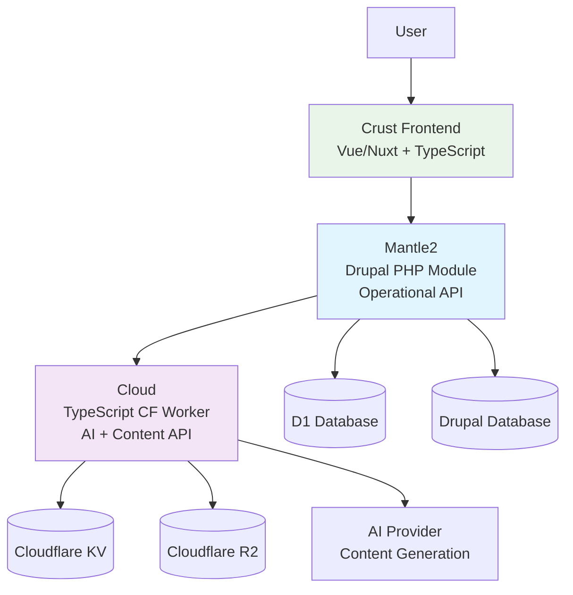
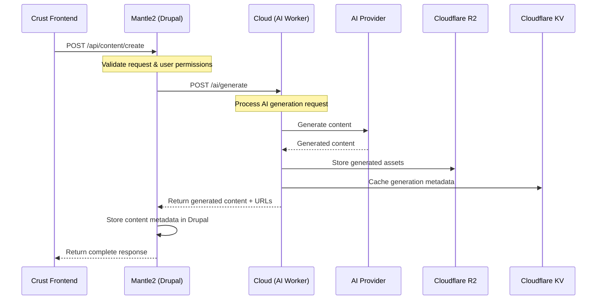
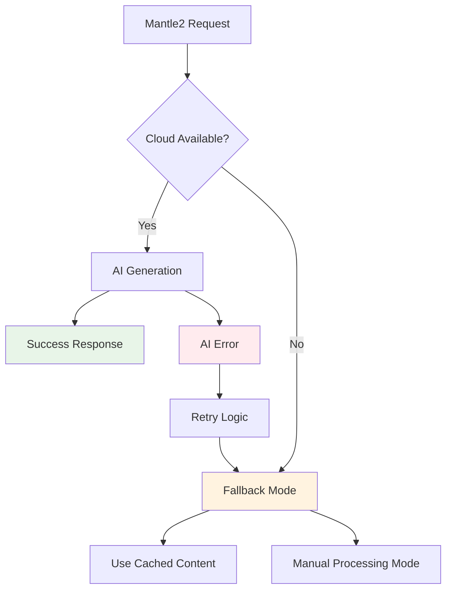

# Hybrid API Architecture (mantle2 + cloud)

The Earth App implements a sophisticated **Hybrid API** architecture that combines the operational capabilities of mantle2 (Drupal) with the AI generation power of cloud (TypeScript Cloudflare Worker).

## Architecture Overview



## Responsibility Distribution

### Mantle2 (State & Orchestration)
**Primary Role:** Business logic, data persistence, user management, and API orchestration

**Responsibilities:**
- User authentication and authorization
- Data validation and business rules
- Database operations (CRUD)
- Workflow orchestration
- API endpoint coordination
- Content metadata management
- Integration with Drupal ecosystem

### Cloud (AI & Content Generation)
**Primary Role:** AI-powered content generation, file processing, and specialized content operations

**Responsibilities:**
- AI model integration and prompt management
- Content generation and transformation
- File upload/download to R2 storage
- Temporary state management in KV
- Content optimization and processing
- AI response caching and optimization

## API Integration Patterns

### Request Flow Sequence



## Hybrid API Endpoints

### Mantle2 → Cloud Integration Points

*Note: Specific endpoint mappings require code analysis from the actual repositories. Below are inferred patterns based on typical hybrid architectures.*

#### Content Generation Flow
```
POST /api/content/generate (mantle2)
  ↓ calls
POST /ai/content/create (cloud)
```

#### File Processing Flow  
```
POST /api/files/process (mantle2)
  ↓ calls
POST /ai/files/transform (cloud)
```

#### Content Enhancement Flow
```
PUT /api/content/{id}/enhance (mantle2)
  ↓ calls  
POST /ai/enhance (cloud)
```

### TODO: Detailed Endpoint Mapping
*This section requires analysis of the actual source code repositories:*

**Files to analyze:**
- `mantle2/`: Drupal routing.yml, Controller classes, Service classes
- `cloud/`: Worker route handlers, API endpoints, function exports
- Look for HTTP client usage (Guzzle, fetch, axios calls)

## Performance Characteristics

### Latency Patterns
- **Mantle2 Direct:** ~50-200ms (database operations)
- **Hybrid Flow:** ~500-2000ms (includes AI generation)
- **Cloud Direct:** ~100-500ms (AI + storage operations)

### Caching Strategy
- **KV Cache:** Temporary AI generation metadata (TTL: 1 hour)
- **Drupal Cache:** Business data and computed results (TTL: configurable)
- **R2 Storage:** Permanent file assets with CDN acceleration

### Error Handling & Resilience



## Operational Concerns

### Monitoring & Observability
**Key Metrics to Track:**
- Hybrid request success rate
- AI generation latency distribution
- Cache hit/miss ratios
- Error rates by integration point
- File storage utilization

### Rate Limiting
- **Mantle2:** Drupal rate limiting modules
- **Cloud:** Cloudflare Worker rate limiting
- **AI Provider:** External API rate limits
- **Cross-service:** Coordinated throttling

### Idempotency & Retries
- **Mantle2:** Database transaction safety
- **Cloud:** Idempotent AI generation keys
- **Storage:** Atomic file operations
- **Retry Strategy:** Exponential backoff with jitter

## Example Integration Flows

### Content Creation Example

```bash
# 1. User initiates content creation via Crust
curl -X POST "{{API_BASE_URL}}/api/content/create" \
  -H "Authorization: Bearer <token>" \
  -H "Content-Type: application/json" \
  -d '{
    "type": "article",
    "prompt": "Write about sustainable technology",
    "metadata": {
      "category": "environment",
      "tags": ["tech", "sustainability"]
    }
  }'

# 2. Mantle2 processes and calls Cloud internally
# (This happens server-to-server)

# 3. Response includes both generated content and metadata
{
  "id": "content_123",
  "content": "Generated article content...",
  "assets": ["https://r2.example.com/images/article_image.jpg"],
  "metadata": {
    "word_count": 750,
    "generation_time": 1.2,
    "ai_model": "gpt-4"
  },
  "status": "published",
  "created_at": "2025-09-29T12:34:56Z"
}
```

### File Processing Example

```javascript
// Frontend upload trigger
const response = await fetch(`${API_BASE}/api/files/process`, {
  method: 'POST',
  headers: {
    'Authorization': `Bearer ${token}`,
    'Content-Type': 'application/json'
  },
  body: JSON.stringify({
    file_url: 'https://example.com/input.pdf',
    processing_type: 'extract_text',
    ai_enhancement: true
  })
});

// Expected response after hybrid processing
{
  "job_id": "proc_456",
  "status": "completed",
  "results": {
    "extracted_text": "Document content...",
    "ai_summary": "Generated summary...",
    "processed_file": "https://r2.example.com/processed/output.json"
  },
  "processing_time": 3.4
}
```

## Development & Testing

### Local Development Setup
```bash
# Start all services for hybrid testing
docker-compose up -d  # Drupal + dependencies
wrangler dev --port 8787  # Cloud worker
npm run dev  # Crust frontend

# Test hybrid flow
curl localhost:8080/api/content/create # → calls localhost:8787/ai/generate
```

### Integration Testing
- **End-to-end:** Test complete user flows through all services
- **Contract Testing:** Validate API contracts between mantle2 ↔ cloud
- **Failure Testing:** Verify graceful degradation when cloud is unavailable
- **Performance Testing:** Load test hybrid request patterns

## Migration & Deployment

### Coordinated Deployments
- **Blue-Green:** Deploy cloud changes first, then mantle2
- **Feature Flags:** Control hybrid integration activation
- **Rollback Strategy:** Independent service rollback capabilities

### Configuration Management
- **Shared Secrets:** API keys for inter-service communication
- **Environment Parity:** Consistent configuration across dev/staging/prod
- **Service Discovery:** Dynamic endpoint configuration

---

## TODO: Implementation Details

This analysis requires deeper investigation of the actual source repositories:

### Required Analysis:
1. **mantle2/modules/custom/**: Examine Drupal module structure
2. **mantle2/src/Controller/**: Find API controllers and HTTP client usage  
3. **cloud/src/**: Analyze worker route handlers and endpoints
4. **cloud/wrangler.toml**: Check environment and binding configuration
5. **crust/**: Frontend API integration patterns

### Investigation Commands:
```bash
# Clone and analyze source repositories
git clone https://github.com/earth-app/mantle2
git clone https://github.com/earth-app/cloud
git clone https://github.com/earth-app/crust

# Search for integration points
grep -r "fetch\|axios\|guzzle" mantle2/
grep -r "export.*handler\|addEventListener" cloud/
grep -r "api\|fetch" crust/
```