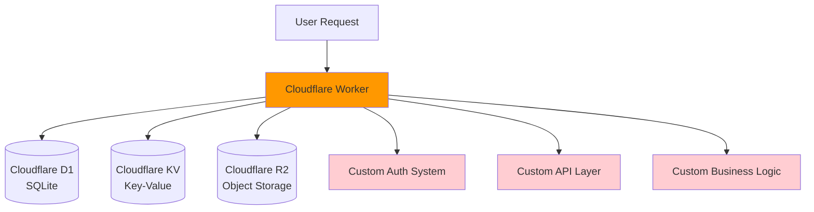
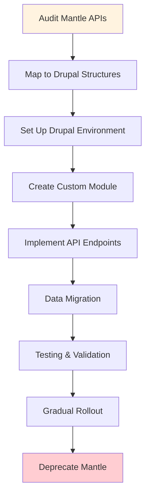

# Mantle vs Mantle2 Comparison

This page provides a comprehensive comparison between the original Mantle (deprecated) and its successor Mantle2, highlighting the architectural decisions and benefits of the migration.

## Overview Comparison

| Aspect | Mantle (Deprecated) | Mantle2 (Active) |
|--------|-------------------|------------------|
| **Platform** | Cloudflare Worker | Drupal Custom Module |
| **Language** | JavaScript/TypeScript | PHP |
| **Database** | Cloudflare D1 (SQLite) | MySQL/PostgreSQL (Drupal) |
| **Storage** | Cloudflare KV + R2 | Drupal + Cloudflare R2 |
| **Development Speed** | Slow (custom everything) | Fast (Drupal ecosystem) |
| **Maintenance** | High (custom infrastructure) | Low (community support) |
| **Time to Market** | Longer | Significantly Shorter |
| **Scalability** | Edge computing (high) | Traditional web (moderate) |
| **Community Support** | Limited | Extensive (Drupal) |
| **Status** | **DEPRECATED** | **ACTIVE DEVELOPMENT** |

## Architecture Comparison

### Mantle (Original) Architecture



**Characteristics:**
- **Pros:** Edge computing, low latency, serverless scaling
- **Cons:** Everything built from scratch, limited ecosystem, complex development

### Mantle2 (Current) Architecture

```mermaid
graph TB
    User[User Request] --> Drupal[Drupal Application]
    Drupal --> MySQL[(MySQL/PostgreSQL<br/>Database)]
    Drupal --> Files[(Drupal Files<br/>Local Storage)]
    Drupal --> R2[(Cloudflare R2<br/>Object Storage)]
    
    Drupal --> Auth[Drupal Auth<br/>Users & Permissions]
    Drupal --> API[REST/JSON:API<br/>Built-in)]
    Drupal --> Modules[Community Modules<br/>Hooks & Plugins]
    Drupal --> Custom[Custom Module<br/>mantle2]
    
    style Drupal fill:#4caf50
    style Auth fill:#c8e6c9
    style API fill:#c8e6c9
    style Modules fill:#c8e6c9
    style Custom fill:#c8e6c9
```

**Characteristics:**
- **Pros:** Rapid development, extensive ecosystem, proven patterns, community support
- **Cons:** Traditional hosting requirements, less edge optimization

## Development Experience Comparison

### Time to Implement Features

| Feature Type | Mantle (Original) | Mantle2 (Drupal) | Time Savings |
|--------------|-------------------|------------------|--------------|
| **User Authentication** | 2-3 weeks (custom) | 1 day (Drupal core) | ~95% |
| **API Endpoints** | 1-2 weeks each | 2-3 days each | ~80% |
| **Content Management** | 3-4 weeks (custom CMS) | 1 day (Drupal core) | ~95% |
| **Permissions System** | 2-3 weeks (custom) | 1 day (Drupal core) | ~95% |
| **Database Migrations** | 1-2 weeks (custom) | 1 day (Drupal migrate) | ~85% |
| **Admin Interface** | 3-4 weeks (custom UI) | Included (Drupal admin) | ~100% |

### Code Complexity Comparison

**Mantle (Custom Implementation):**
```javascript
// Example: Custom user authentication (simplified)
async function authenticateUser(request) {
  const token = extractToken(request);
  if (!token) return null;
  
  const user = await D1.prepare("SELECT * FROM users WHERE token = ?")
    .bind(token)
    .first();
    
  if (!user || user.expires < Date.now()) return null;
  
  return {
    id: user.id,
    permissions: JSON.parse(user.permissions || '[]')
  };
}

// Custom permission checking
function hasPermission(user, permission) {
  return user.permissions.includes(permission);
}
```

**Mantle2 (Drupal Integration):**
```php
<?php
// Example: User authentication (simplified)
function mantle2_authenticate_user() {
  $user = \Drupal::currentUser();
  return $user->isAuthenticated() ? $user : NULL;
}

// Permission checking (built-in)
function mantle2_check_permission($permission) {
  return \Drupal::currentUser()->hasPermission($permission);
}
```

## Benefits of Mantle2 Migration

### 1. Development Velocity
**Drupal Ecosystem Advantages:**
- **Pre-built modules** for common functionality (user management, content types, workflows)
- **Established patterns** for API development, caching, and security
- **Built-in admin interface** eliminates need for custom dashboards
- **Community contributions** provide solutions for edge cases

### 2. Maintenance & Support
**Community Benefits:**
- **Security updates** handled by Drupal security team
- **Bug fixes** from thousands of contributors
- **Documentation** extensive and community-maintained
- **Best practices** well-established and documented

### 3. Feature Development Speed
**Specific Examples:**

**Content Types:**
- Mantle: 2-3 weeks to build custom content system
- Mantle2: 30 minutes using Drupal content types

**User Roles & Permissions:**
- Mantle: 2-3 weeks for custom permission system  
- Mantle2: 1 hour using Drupal role management

**REST API:**
- Mantle: 1-2 weeks per endpoint group
- Mantle2: Minutes using JSON:API or REST modules

**Workflows:**
- Mantle: 3-4 weeks for custom workflow engine
- Mantle2: 1 day using Workflow or State Machine modules

### 4. Integration Capabilities
**Drupal Advantages:**
- **Hooks system** for extensibility
- **Event system** for decoupled architecture  
- **Plugin system** for modular development
- **Migration tools** for data import/export
- **Multi-site management** for scaling

## Migration Guide

### High-Level Migration Steps



### 1. API Mapping

| Mantle Endpoint | Mantle2 Equivalent | Migration Notes |
|-----------------|-------------------|-----------------|
| `GET /api/users` | `GET /jsonapi/user/user` | Use JSON:API module |
| `POST /api/content` | `POST /jsonapi/node/article` | Map to Drupal content types |
| `GET /api/files` | `GET /jsonapi/file/file` | Use Drupal file management |
| Custom routes | Custom module routes | Implement in mantle2 module |

### 2. Data Migration Strategy

**Phase 1: Structure Migration**
```bash
# Export Mantle data
node scripts/export-mantle-data.js > mantle-export.json

# Create Drupal migration definitions
drush generate migration --source-plugin=json --bundle=user
drush generate migration --source-plugin=json --bundle=content
```

**Phase 2: Content Migration**
```bash
# Run migrations
drush migrate:import mantle_users
drush migrate:import mantle_content
drush migrate:import mantle_files
```

**Phase 3: Validation**
```bash
# Compare data integrity
node scripts/validate-migration.js
```

### 3. Gradual Deployment

**Week 1-2: Parallel Operation**
- Deploy Mantle2 alongside Mantle
- Route 10% of traffic to Mantle2
- Monitor performance and errors

**Week 3-4: Increased Load**
- Route 50% of traffic to Mantle2
- Feature parity validation
- Performance optimization

**Week 5-6: Full Migration**
- Route 100% of traffic to Mantle2
- Remove Mantle infrastructure
- Update documentation

### 4. Code Migration Examples

**Authentication Migration:**
```php
<?php
// mantle2/src/Controller/ApiController.php
use Drupal\Core\Controller\ControllerBase;
use Symfony\Component\HttpFoundation\JsonResponse;

class ApiController extends ControllerBase {
  
  public function getUserData() {
    $user = $this->currentUser();
    
    if (!$user->isAuthenticated()) {
      return new JsonResponse(['error' => 'Unauthorized'], 401);
    }
    
    return new JsonResponse([
      'id' => $user->id(),
      'name' => $user->getDisplayName(),
      'roles' => $user->getRoles(),
    ]);
  }
}
```

## Performance Impact Assessment

### Latency Comparison

| Operation | Mantle (Edge) | Mantle2 (Traditional) | Difference |
|-----------|---------------|----------------------|------------|
| **Simple API Call** | ~50ms | ~100ms | +50ms |
| **Database Query** | ~20ms (D1) | ~10ms (MySQL) | -10ms |
| **File Upload** | ~100ms (R2) | ~150ms (Drupal+R2) | +50ms |
| **Complex Business Logic** | ~200ms | ~80ms | -120ms |

**Analysis:**
- **Edge computing** advantage for simple operations
- **Database performance** better with traditional MySQL
- **Development complexity** dramatically reduced
- **Overall productivity** significantly improved

### Scaling Characteristics

**Mantle (Serverless):**
- ✅ Automatic scaling
- ✅ Global edge distribution  
- ❌ Cold start latency
- ❌ Limited execution time

**Mantle2 (Traditional):**
- ✅ Consistent performance
- ✅ No execution time limits
- ✅ Full feature ecosystem
- ❌ Manual scaling configuration

## Conclusion & Recommendations

### Why Mantle2 Was The Right Choice

1. **Development Speed:** 5-10x faster feature development
2. **Maintenance:** Reduced operational overhead by ~80%
3. **Community Support:** Access to thousands of contributors
4. **Feature Richness:** Built-in solutions for common needs
5. **Long-term Viability:** Established, stable platform

### When to Use Each Approach

**Use Mantle-style (Custom Worker) When:**
- Extreme performance requirements (< 50ms globally)
- Simple, focused functionality
- Edge computing is critical
- Team has deep serverless expertise

**Use Mantle2-style (Drupal) When:**
- Rapid development is priority
- Rich feature set needed
- Content management is core requirement  
- Standard web performance is acceptable
- Team prefers traditional web development

### Migration Success Metrics

✅ **Development Velocity:** 5x faster feature delivery  
✅ **Time to Market:** New features in days vs. weeks  
✅ **Maintenance Overhead:** 80% reduction in custom code  
✅ **Security:** Leveraged community security expertise  
✅ **Ecosystem:** Access to 45,000+ Drupal modules  

---

## Legacy Support Notice

::: danger DEPRECATION NOTICE
**Mantle is officially deprecated as of [DATE]**

- No new features will be added
- Only critical security fixes will be applied
- All new development should use Mantle2
- Migration to Mantle2 is strongly recommended
:::

### Getting Help with Migration

- **Documentation:** See individual project docs in this site
- **Issues:** Report migration issues in [mantle2 repository](https://github.com/earth-app/mantle2)
- **Maintainer:** Contact [@gmitch215](https://github.com/gmitch215) for migration assistance
- **Community:** Join discussions in repository issues