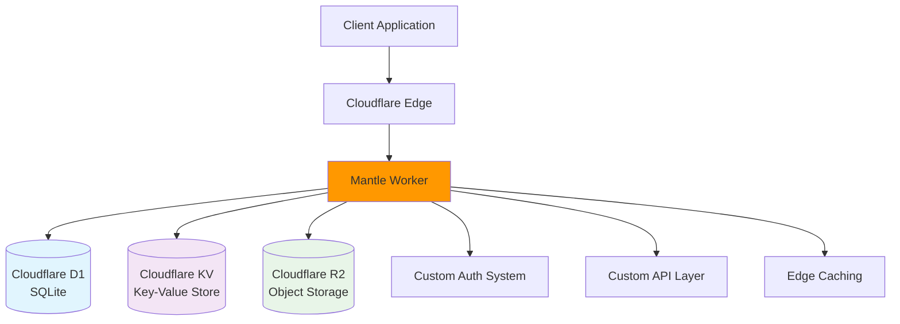

# Mantle (Deprecated)

::: danger DEPRECATION NOTICE
**Mantle is officially deprecated.** This project is no longer under active development. 

- **New development:** Use [Mantle2](/docs/mantle2/) instead
- **Existing users:** Please migrate to Mantle2 as soon as possible
- **Support:** Limited to critical security fixes only
- **Timeline:** Support ends [DATE_TBD]
:::

## Migration Notice

**Recommended Action:** Migrate to [Mantle2](/docs/mantle2/) for:
- ✅ 5-10x faster development 
- ✅ Rich Drupal ecosystem
- ✅ Built-in admin interface
- ✅ Community support and security updates
- ✅ Easier maintenance and scaling

**Migration Guide:** See [Mantle vs Mantle2 Comparison](/docs/mantle-vs-mantle2) for detailed migration instructions.

---

## Legacy Documentation

### Architecture Overview

Mantle was the original API backend built as a Cloudflare Worker, providing edge computing capabilities with global distribution.



**Technology Stack:**
- **Platform:** Cloudflare Workers (V8 isolates)
- **Language:** JavaScript/TypeScript
- **Database:** Cloudflare D1 (SQLite)
- **Storage:** Cloudflare KV + R2
- **Deployment:** Wrangler CLI

### Key Features (Legacy)

#### Edge Computing Benefits
- **Global Distribution:** Sub-50ms response times worldwide
- **Auto Scaling:** Serverless scaling to zero and infinite
- **Cost Efficient:** Pay-per-request pricing model
- **High Availability:** Built-in redundancy and failover

#### Storage Architecture
- **D1 Database:** SQLite for relational data
- **KV Store:** Fast key-value storage for sessions/cache
- **R2 Storage:** S3-compatible object storage for files

---

## API Reference (Legacy)

::: warning LIMITED DOCUMENTATION
These endpoints are deprecated. Refer to actual source code for complete implementation details.
New integrations should use [Mantle2 APIs](/docs/mantle2/) instead.
:::

### Authentication

#### POST /auth/login
**Description:** User authentication endpoint

**Request:**
```bash
curl -X POST "https://api.mantle.earth-app.example/auth/login" \
  -H "Content-Type: application/json" \
  -d '{
    "email": "user@example.com",
    "password": "password123"
  }'
```

**Response:**
```json
{
  "token": "eyJhbGciOiJIUzI1NiIsInR5cCI6IkpXVCJ9...",
  "expires": "2025-09-30T12:34:56Z",
  "user": {
    "id": "user_123",
    "email": "user@example.com",
    "role": "authenticated"
  }
}
```

**Migration to Mantle2:**
```php
// Equivalent in Mantle2 (Drupal)
POST /user/login?_format=json
```

#### GET /auth/me
**Description:** Get current user information

**Request:**
```bash
curl -X GET "https://api.mantle.earth-app.example/auth/me" \
  -H "Authorization: Bearer <token>"
```

**Migration to Mantle2:**
```php
// Equivalent in Mantle2
GET /jsonapi/user/user/{uuid}
```

### Content Management

#### GET /api/content
**Description:** List content items

**Request:**
```bash
curl -X GET "https://api.mantle.earth-app.example/api/content" \
  -H "Authorization: Bearer <token>" \
  -H "Accept: application/json"
```

**Response:**
```json
{
  "data": [
    {
      "id": "content_123",
      "type": "article",
      "title": "Example Article",
      "content": "Article content...",
      "created_at": "2025-09-29T12:34:56Z",
      "author_id": "user_456"
    }
  ],
  "meta": {
    "total": 1,
    "page": 1,
    "per_page": 20
  }
}
```

**Migration to Mantle2:**
```php
// Equivalent in Mantle2
GET /jsonapi/node/article
```

#### POST /api/content
**Description:** Create new content

**Request:**
```bash
curl -X POST "https://api.mantle.earth-app.example/api/content" \
  -H "Authorization: Bearer <token>" \
  -H "Content-Type: application/json" \
  -d '{
    "type": "article",
    "title": "New Article",
    "content": "Article content...",
    "tags": ["example", "test"]
  }'
```

**Migration to Mantle2:**
```php
// Equivalent in Mantle2
POST /jsonapi/node/article
```

### File Management

#### POST /api/files/upload
**Description:** Upload file to R2 storage

**Request:**
```bash
curl -X POST "https://api.mantle.earth-app.example/api/files/upload" \
  -H "Authorization: Bearer <token>" \
  -F "file=@example.jpg" \
  -F "metadata={\"alt\":\"Example image\"}"
```

**Response:**
```json
{
  "id": "file_789",
  "url": "https://files.earth-app.example/uploads/example.jpg",
  "size": 1024000,
  "type": "image/jpeg",
  "uploaded_at": "2025-09-29T12:34:56Z"
}
```

**Migration to Mantle2:**
```php
// Equivalent in Mantle2
POST /jsonapi/file/file
```

---

## Database Schema (Legacy)

::: warning SCHEMA DOCUMENTATION
This schema is for reference only. Do not create new integrations with this database structure.
:::

### Users Table
```sql
CREATE TABLE users (
  id TEXT PRIMARY KEY,
  email TEXT UNIQUE NOT NULL,
  password_hash TEXT NOT NULL,
  role TEXT DEFAULT 'user',
  created_at DATETIME DEFAULT CURRENT_TIMESTAMP,
  updated_at DATETIME DEFAULT CURRENT_TIMESTAMP
);
```

### Content Table
```sql
CREATE TABLE content (
  id TEXT PRIMARY KEY,
  type TEXT NOT NULL,
  title TEXT NOT NULL,
  content TEXT,
  author_id TEXT REFERENCES users(id),
  created_at DATETIME DEFAULT CURRENT_TIMESTAMP,
  updated_at DATETIME DEFAULT CURRENT_TIMESTAMP
);
```

### Files Table
```sql
CREATE TABLE files (
  id TEXT PRIMARY KEY,
  filename TEXT NOT NULL,
  size INTEGER,
  type TEXT,
  r2_key TEXT UNIQUE NOT NULL,
  uploaded_by TEXT REFERENCES users(id),
  created_at DATETIME DEFAULT CURRENT_TIMESTAMP
);
```

---

## Migration Guide

### 1. Data Export from Mantle

**Export Users:**
```bash
# Connect to D1 database
wrangler d1 execute mantle-db --command "SELECT * FROM users;" > users_export.json
```

**Export Content:**
```bash
wrangler d1 execute mantle-db --command "SELECT * FROM content;" > content_export.json
```

**Export Files:**
```bash
wrangler d1 execute mantle-db --command "SELECT * FROM files;" > files_export.json
```

### 2. API Mapping to Mantle2

| Mantle Endpoint | Mantle2 Equivalent | Notes |
|-----------------|-------------------|-------|
| `POST /auth/login` | `POST /user/login?_format=json` | Use Drupal authentication |
| `GET /auth/me` | `GET /jsonapi/user/user/{uuid}` | JSON:API format |
| `GET /api/content` | `GET /jsonapi/node/article` | Use content type entities |
| `POST /api/content` | `POST /jsonapi/node/article` | Create via JSON:API |
| `PUT /api/content/{id}` | `PATCH /jsonapi/node/article/{uuid}` | Update via JSON:API |
| `DELETE /api/content/{id}` | `DELETE /jsonapi/node/article/{uuid}` | Delete via JSON:API |
| `POST /api/files/upload` | `POST /jsonapi/file/file` | Use Drupal file entities |

### 3. Code Migration Examples

**Authentication (Before - Mantle):**
```javascript
// mantle/src/auth.js
async function login(email, password) {
  const user = await D1.prepare("SELECT * FROM users WHERE email = ?")
    .bind(email)
    .first();
    
  if (!user || !await bcrypt.compare(password, user.password_hash)) {
    throw new Error('Invalid credentials');
  }
  
  const token = jwt.sign({ userId: user.id }, JWT_SECRET);
  return { token, user };
}
```

**Authentication (After - Mantle2):**
```php
<?php
// mantle2/src/Controller/AuthController.php
use Drupal\user\Entity\User;

public function login(Request $request) {
  $credentials = json_decode($request->getContent(), TRUE);
  
  $uid = \Drupal::service('user.auth')->authenticate(
    $credentials['name'], 
    $credentials['pass']
  );
  
  if ($uid) {
    $user = User::load($uid);
    return new JsonResponse(['user' => $user->toArray()]);
  }
  
  return new JsonResponse(['error' => 'Invalid credentials'], 401);
}
```

### 4. Frontend Integration Updates

**API Client (Before - Mantle):**
```javascript
// Frontend calling Mantle
const response = await fetch('https://api.mantle.earth-app.example/api/content', {
  headers: {
    'Authorization': `Bearer ${token}`,
    'Accept': 'application/json'
  }
});
```

**API Client (After - Mantle2):**
```javascript
// Frontend calling Mantle2
const response = await fetch('https://api.mantle2.earth-app.example/jsonapi/node/article', {
  headers: {
    'Authorization': `Bearer ${token}`,
    'Accept': 'application/vnd.api+json'  // JSON:API format
  }
});
```

---

## Development Setup (Legacy)

::: warning MAINTENANCE ONLY
This setup is for maintenance purposes only. New development should use Mantle2.
:::

### Prerequisites
- Node.js 18+
- Wrangler CLI
- Cloudflare account with Workers enabled

### Local Development
```bash
# Clone repository (for maintenance only)
git clone https://github.com/earth-app/mantle.git
cd mantle

# Install dependencies
npm install

# Configure environment
cp wrangler.toml.example wrangler.toml
# Edit wrangler.toml with your Cloudflare configuration

# Start local development
wrangler dev

# Test endpoints
curl http://localhost:8787/health
```

### Testing
```bash
# Run unit tests
npm test

# Run integration tests
npm run test:integration

# Test with Cloudflare environment
npm run test:e2e
```

### Deployment (Emergency Only)
```bash
# Deploy to staging
wrangler publish --env staging

# Deploy to production (emergency fixes only)
wrangler publish --env production
```

---

## Support & Maintenance

### Security Issues
**Critical security vulnerabilities will be patched.** Report security issues to:
- **Email:** security@earth-app.example (TODO: Add real email)
- **GitHub:** Private security advisory in repository

### Bug Reports
**Only critical bugs affecting production systems will be addressed.**
- **Repository:** https://github.com/earth-app/mantle/issues
- **Template:** Use "Bug Report (Legacy)" template
- **Priority:** P0 (production breaking) only

### Migration Support
For help migrating from Mantle to Mantle2:
- **Documentation:** [Migration Guide](/docs/mantle-vs-mantle2)
- **Issues:** File in [moon repository](https://github.com/earth-app/moon/issues)
- **Contact:** [@gmitch215](https://github.com/gmitch215)

---

## Timeline & Roadmap

### Deprecation Schedule
- **2025 Q4:** Deprecation announcement ✅
- **2026 Q1:** Stop non-critical bug fixes
- **2026 Q2:** Stop feature requests entirely
- **2026 Q3:** Security fixes only
- **2026 Q4:** End of life, no further updates

### Recommended Actions
1. **Immediate:** Stop new Mantle integrations
2. **Q1 2026:** Begin migration planning to Mantle2
3. **Q2 2026:** Complete migration to Mantle2
4. **Q3 2026:** Remove Mantle dependencies

---

## Alternatives

### Primary Recommendation: Mantle2
- **Repository:** https://github.com/earth-app/mantle2
- **Documentation:** [Mantle2 Overview](/docs/mantle2/)
- **Migration Guide:** [Mantle vs Mantle2](/docs/mantle-vs-mantle2)

### Other Options
For projects not suitable for Drupal:
- **Custom Node.js API:** Express/Fastify + PostgreSQL
- **Laravel API:** PHP framework with similar ecosystem benefits
- **Django REST Framework:** Python alternative with rapid development

**Recommendation:** Mantle2 provides the best balance of development speed, ecosystem support, and maintenance overhead for most use cases.