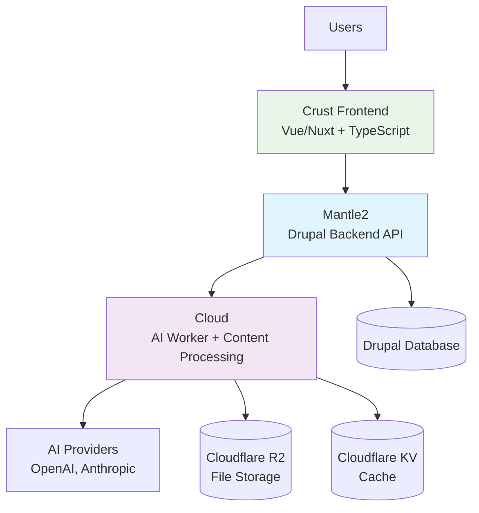

---
# https://vitepress.dev/reference/default-theme-home-page
layout: home

hero:
  name: 'The Earth App'
  text: 'Sustainable Technology Platform'
  tagline: Comprehensive API documentation and technical specifications for the complete Earth App ecosystem
  actions:
    - theme: brand
      text: Get Started
      link: /docs/CONTRIBUTING
    - theme: alt
      text: Hybrid API Guide
      link: /docs/hybrid-api
    - theme: alt
      text: View on GitHub
      link: https://github.com/earth-app

features:
  - title: 🏗️ Mantle2 (Primary API)
    details: Drupal-based operational backend providing 5-10x faster development with extensive ecosystem support, user management, and content operations.
    link: /docs/mantle2/
  - title: ☁️ Cloud (AI Worker)
    details: TypeScript Cloudflare Worker delivering AI-powered content generation, file processing, and intelligent automation capabilities.
    link: /docs/cloud/
  - title: 🎨 Crust (Frontend)
    details: Modern Vue/Nuxt application with responsive design, real-time AI integration, and optimized user experience.
    link: /docs/crust/
  - title: 🔗 Hybrid API Architecture
    details: Seamless integration between Mantle2 and Cloud, combining operational efficiency with AI-powered content generation.
    link: /docs/hybrid-api
  - title: 📚 Complete Documentation
    details: Full API references with multi-language code examples (cURL, Node.js, Python, Java), architecture diagrams, and integration guides.
    link: /docs/CONTRIBUTING
  - title: ⚠️ Legacy Support
    details: Migration guidance from deprecated Mantle to modern Mantle2, with comprehensive comparison and upgrade paths.
    link: /docs/mantle-vs-mantle2
---

## Architecture Overview

The Earth App implements a sophisticated **Hybrid API** architecture that combines:

- **Operational APIs** (Mantle2) for data management, user authentication, and business logic
- **AI Generation** (Cloud) for content creation, enhancement, and intelligent processing  
- **Frontend Interface** (Crust) for responsive user interactions and real-time updates



## Quick Navigation

### 🚀 Start Here
- **[Contributing Guide](/docs/CONTRIBUTING)** - Development setup for all projects
- **[Hybrid API Overview](/docs/hybrid-api)** - Understanding the integrated architecture
- **[Organization Info](/docs/_data/ORG_METADATA)** - Project links and contact information

### 📖 Project Documentation
- **[Mantle2 (Primary)](/docs/mantle2/)** - Active development, full API reference
- **[Cloud (AI Worker)](/docs/cloud/)** - AI endpoints and content processing
- **[Crust (Frontend)](/docs/crust/)** - UI components and integration patterns
- **[Mantle (Deprecated)](/docs/mantle/)** - Legacy documentation and migration guide

### 🏗️ Architecture & Analysis
- **[Project Comparison](/docs/mantle-vs-mantle2)** - Why Mantle2 replaced Mantle
- **[Git History Analysis](/docs/commit-summary)** - Project evolution and contributors
- **[Implementation TODOs](/docs/TODOS)** - Missing information and next steps

## Example Integration

```javascript
// Frontend (Crust) → Backend (Mantle2) → AI (Cloud)
const response = await fetch('/api/mantle2/content/generate', {
  method: 'POST',
  headers: { 'Authorization': `Bearer ${token}` },
  body: JSON.stringify({
    prompt: 'Write about sustainable technology trends',
    type: 'article',
    options: { ai_enhance: true }
  })
});

// Response includes both generated content and metadata
const { content, metadata } = await response.json();
```

---

**Maintained by**: [@gmitch215](https://github.com/gmitch215) | **Organization**: [@earth-app](https://github.com/earth-app)
